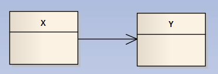
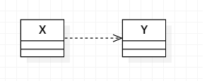

# UML类图

## 目录

* [类关系](#类关系)


---

## 类关系

* Assocation (knows a)
* Dependency (uses a)
* Composition (has a)
* Aggregation (has a)
* Inheritance (is a)
---

* Assocation（关联）

    一个对象知道另一个对象的存在，该对象持有另一个对象的指针或者引用。

    ```
    class X
    {
    public:
        X(Y* _ptrY):ptrY_(_ptrY) {}
        void setY(Y *y) { ptrY_ = y;}
        void f() { ptrY_->foo();}
    private/public:
        Y* ptrY_;       // X类持有Y的一个指针，可据此调用Y中的成员方法
    }
    ```

    

* dependency（依赖）

    当类Y与类X彼此独立，而类Y是类X成员函数的一个参数，或者X中成员函数的一个局部变量。 

    ```
    class X
    {
    ...
        void f1(Y y) { ...; y.foo(); }
        void f2(Y& y) { ...; y.foo(); }
        void f3(Y* y) { ...; y->foo(); }
        void f4() { ...; Y y; y.foo(); }
        void f5() { Y::staticFoo();}
    ...
    }
    ```

    

* Aggregation (聚合)

    一个类是另一个类的集合或者容器，但被包含的类与容器本身并不具备相同的生命期，**也就是容器销毁时，其包含的内容未必。**
    
    关联（association）与聚合（aggregation）的不同之处在于，关联关系不存在一个明确的容器包含另外一个类。比如汽车和轮胎的关系，就是一种聚合关系，汽车包含着轮胎的集合，汽车的销毁，轮胎仍然可以存在。

    ```
    class Window
    {
    public:
        //...
    private:
        vectr<Shape*> ptrShapes; 
    }
    ```

    

* Composition（组合）

    组合（composition）是聚合（Aggregation）的增强版。组合和聚合的根本不同在于类与其所持有元素的是否具有相同的生命期，要求必须相同是一种组合关系。

    **Aggregation,表达的是持有指针和引用，而Composition组合关系，持有的是对象。**

    ```
    class Circle
    {
    private:
        ...
        Point center_;
        ...
    }
    ```

    

* 继承

    继承可能是最常见的关系了，derived class B is a base class A 。


    

## 参考

https://blog.csdn.net/lanchunhui/article/details/49557083

https://design-patterns.readthedocs.io/zh_CN/latest/read_uml.html