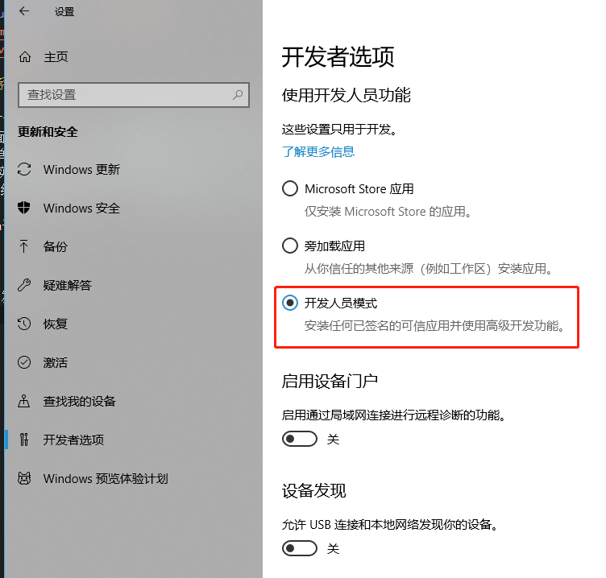
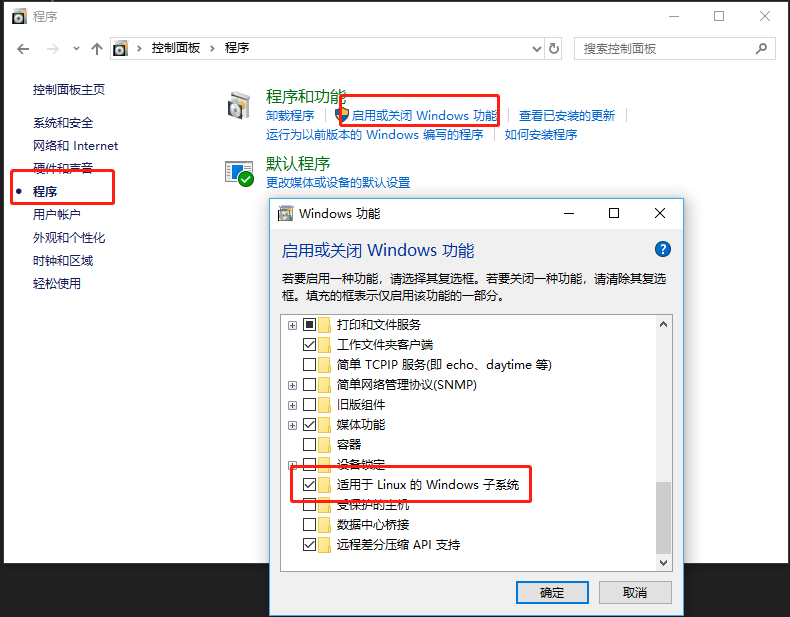
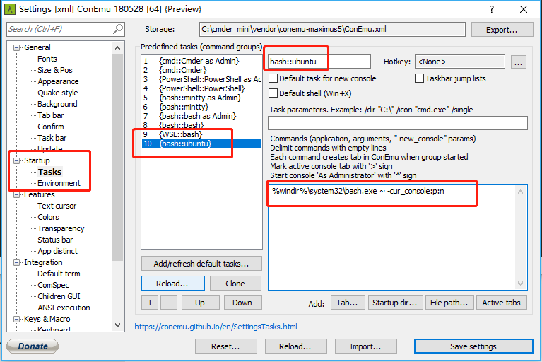

# 我的工具栈 ubuntu子系统 + cmder 

## 目录

* [win10 ubuntu子系统](ubuntu子系统)
* [cmder](cmder)
* [vscode](vscode)

## ubuntu子系统

window 10 对于我来说，最棒的更新就是加入了ubuntu的子系统。对于我来说，日常写代码是在linux下面，而处理文档，干其他的事情，我又习惯于在winodw下面。这样一个单独的linux和一个单独的window，都没有办法满足我的需求。于是，一直都是window下面开个ssh的终端，连到实验室的服务器上面或者是开虚拟机。window 10 在新的更新里面，加入了ubuntu的子系统。这样就可以非常方便的满足我的全部需求。简直太开心啦。

* 安装ubuntu子系统

    * 第一步

        在设置的开发者选项里面，开启开发者模式 
        

    * 第二步

        在控制面板的程序里面，开始ubuntu子系统
        

    * 第三步
        在window的商店里面 安装ubuntu就可以了
        
    
    * 安装成功，启动ubuntu

        

    * 如何共享文件

        window的磁盘默认挂在ubuntu的 /mnt下面，切换到这个目录下面会找到window的c,d盘。

        如果想共享一个文件夹，可以创建一个软连接
        ```
        sudo ln -s /mnt/d/Downloads Downloads
        ```

## cmder

安装好ubuntu子系统之后，就可以使用Ubuntu了。但是这个终端的这个字体和配色，并不是很友好。所以，这个cmder的工具就可以发挥出用途。

cmnder是一个window的下面的一个终端工具，类似于git bash的感觉。通过它来登陆ubuntu，就基本上可以获得一个ubuntu终端的体验。


* 安装和配置的步骤

    * 下载
    
        http://cmder.net/
    
    * 把 cmder 加到环境变量

        可以把Cmder.exe存放的目录添加到系统环境变量；加完之后,Win+r一下输入cmder,即可。

    * 添加 cmder 到右键菜单

        在某个文件夹中打开终端, 这个是一个(超级)痛点需求, 实际上上一步的把 cmder 加到环境变量就是为此服务的, 在管理员权限的终端输入以下语句即可:

        ```
        Cmder.exe /REGISTER ALL
        ```

    * 配置进入ubuntu的快捷方式
        ```
        %windir%\system32\bash.exe ~ -cur_console:p:n
        ```

        

    * 修改 $ 的符号

        设置界面 > mian > font > monospce,去掉那勾勾即可。