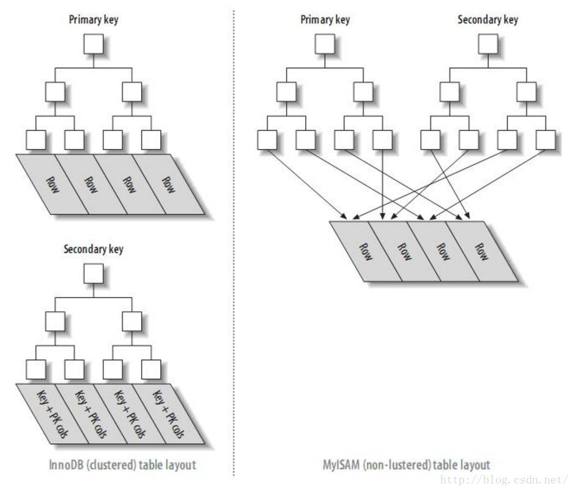

# 数据库

## 目录

* [存储引擎](#存储引擎)
* [事务](#事务)
* [写高效的SQL语句](#写高效的SQL语句)

---

## 存储引擎

* MYISAM / INNODB 的区别

    1. MYSQL(5.1的版本之后)的默认存储引擎 INNODB

    2. innodb 支持粒度更小的锁，也就是行锁

    3. innodb 支持事务

    4. 我的一个个人看法，innodb 设计的比较晚，相对于比较周全，如果没有什么特殊癖好，用innodb更好。这好像也是官方给出的建议。

* 聚簇索引和非聚簇索引

    MyISAM 是非聚簇索引，innodb是聚簇索引。 聚簇索引和非聚簇索引的一个根本的区别是，索引和真正的数据是否是存放在一起的。如果是在一起，就是聚簇索引，如果不在一起，就是非聚簇索引。

    如下图所示：
    

## 事务

* 事务的特性

    ACID

* 事务的隔离等级

    四个隔离等级是：
    1. 未提交读
    2. 提交读
    3. 重复读
    4. 序列化

    解决的问题是：

    1. 脏读
    2. 不可重复度
    3. 幻读 

## 写高效的SQL语句

* explain

